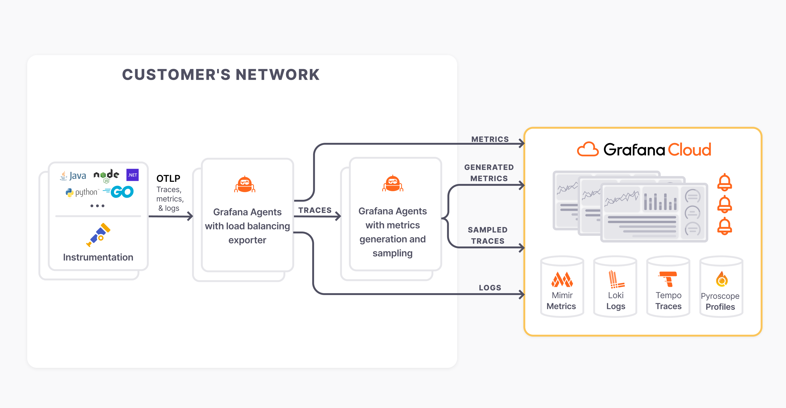

# grafana-sampling

  

A Helm chart for a layered OTLP tail sampling and metrics generation pipeline.

This chart deploys the following architecture to your environment:


Note: by default, only OTLP traces are accepted at the load balancing layer.

## Chart Repo

Add the following repo to use the chart:

```console
helm repo add grafana https://grafana.github.io/helm-charts
```
## Installing the Chart

Use the following command to install the chart with the release name `my-release`. Make sure to populate the required values.

```console
helm install my-release grafana/grafana-sampling --values - <<EOF | less
grafana-agent-statefulset:
  agent:
    extraEnv:
      - name: GRAFANA_CLOUD_API_KEY
        value: <REQUIRED>
      - name: GRAFANA_CLOUD_PROMETHEUS_URL
        value: <REQUIRED>
      - name: GRAFANA_CLOUD_PROMETHEUS_USERNAME
        value: <REQUIRED>
      - name: GRAFANA_CLOUD_TEMPO_ENDPOINT
        value: <REQUIRED>
      - name: GRAFANA_CLOUD_TEMPO_USERNAME
        value: <REQUIRED>
      # This is required for adaptive metric deduplication in Grafana Cloud
      - name: POD_UID
        valueFrom:
          fieldRef:
            apiVersion: v1
            fieldPath: metadata.uid
EOF
```

## Uninstalling the Chart

To uninstall/delete the my-release deployment:

```console
helm delete my-release
```

The command removes all the Kubernetes components associated with the chart and deletes the release.

## Upgrading

A major chart version change indicates that there is an incompatible breaking change needing manual actions.

## Values

| Key | Type | Default | Description |
|-----|------|---------|-------------|
| grafana-agent-deployment.agent.configMap.create | bool | `false` |  |
| grafana-agent-deployment.agent.extraPorts[0].name | string | `"otlp-grpc"` |  |
| grafana-agent-deployment.agent.extraPorts[0].port | int | `4317` |  |
| grafana-agent-deployment.agent.extraPorts[0].protocol | string | `"TCP"` |  |
| grafana-agent-deployment.agent.extraPorts[0].targetPort | int | `4317` |  |
| grafana-agent-deployment.agent.extraPorts[1].name | string | `"otlp-http"` |  |
| grafana-agent-deployment.agent.extraPorts[1].port | int | `4318` |  |
| grafana-agent-deployment.agent.extraPorts[1].protocol | string | `"TCP"` |  |
| grafana-agent-deployment.agent.extraPorts[1].targetPort | int | `4318` |  |
| grafana-agent-deployment.agent.resources.requests.cpu | string | `"1"` |  |
| grafana-agent-deployment.agent.resources.requests.memory | string | `"2G"` |  |
| grafana-agent-deployment.controller.autoscaling.enabled | bool | `false` | Creates a HorizontalPodAutoscaler for controller type deployment. |
| grafana-agent-deployment.controller.autoscaling.maxReplicas | int | `5` | The upper limit for the number of replicas to which the autoscaler can scale up. |
| grafana-agent-deployment.controller.autoscaling.minReplicas | int | `2` | The lower limit for the number of replicas to which the autoscaler can scale down. |
| grafana-agent-deployment.controller.autoscaling.targetCPUUtilizationPercentage | int | `0` | Average CPU utilization across all relevant pods, a percentage of the requested value of the resource for the pods. Setting `targetCPUUtilizationPercentage` to 0 will disable CPU scaling. |
| grafana-agent-deployment.controller.autoscaling.targetMemoryUtilizationPercentage | int | `80` | Average Memory utilization across all relevant pods, a percentage of the requested value of the resource for the pods. Setting `targetMemoryUtilizationPercentage` to 0 will disable Memory scaling. |
| grafana-agent-deployment.controller.replicas | int | `1` |  |
| grafana-agent-deployment.controller.type | string | `"deployment"` |  |
| grafana-agent-deployment.nameOverride | string | `"deployment"` | Do not change this. |
| grafana-agent-statefulset.agent.configMap.create | bool | `false` |  |
| grafana-agent-statefulset.agent.extraEnv[0].name | string | `"GRAFANA_CLOUD_API_KEY"` |  |
| grafana-agent-statefulset.agent.extraEnv[0].value | string | `"<REQUIRED>"` |  |
| grafana-agent-statefulset.agent.extraEnv[1].name | string | `"GRAFANA_CLOUD_PROMETHEUS_URL"` |  |
| grafana-agent-statefulset.agent.extraEnv[1].value | string | `"<REQUIRED>"` |  |
| grafana-agent-statefulset.agent.extraEnv[2].name | string | `"GRAFANA_CLOUD_PROMETHEUS_USERNAME"` |  |
| grafana-agent-statefulset.agent.extraEnv[2].value | string | `"<REQUIRED>"` |  |
| grafana-agent-statefulset.agent.extraEnv[3].name | string | `"GRAFANA_CLOUD_TEMPO_ENDPOINT"` |  |
| grafana-agent-statefulset.agent.extraEnv[3].value | string | `"<REQUIRED>"` |  |
| grafana-agent-statefulset.agent.extraEnv[4].name | string | `"GRAFANA_CLOUD_TEMPO_USERNAME"` |  |
| grafana-agent-statefulset.agent.extraEnv[4].value | string | `"<REQUIRED>"` |  |
| grafana-agent-statefulset.agent.extraEnv[5].name | string | `"POD_UID"` |  |
| grafana-agent-statefulset.agent.extraEnv[5].valueFrom.fieldRef.apiVersion | string | `"v1"` |  |
| grafana-agent-statefulset.agent.extraEnv[5].valueFrom.fieldRef.fieldPath | string | `"metadata.uid"` |  |
| grafana-agent-statefulset.agent.extraPorts[0].name | string | `"otlp-grpc"` |  |
| grafana-agent-statefulset.agent.extraPorts[0].port | int | `4317` |  |
| grafana-agent-statefulset.agent.extraPorts[0].protocol | string | `"TCP"` |  |
| grafana-agent-statefulset.agent.extraPorts[0].targetPort | int | `4317` |  |
| grafana-agent-statefulset.agent.resources.requests.cpu | string | `"1"` |  |
| grafana-agent-statefulset.agent.resources.requests.memory | string | `"2G"` |  |
| grafana-agent-statefulset.controller.autoscaling.enabled | bool | `false` | Creates a HorizontalPodAutoscaler for controller type deployment. |
| grafana-agent-statefulset.controller.autoscaling.maxReplicas | int | `5` | The upper limit for the number of replicas to which the autoscaler can scale up. |
| grafana-agent-statefulset.controller.autoscaling.minReplicas | int | `2` | The lower limit for the number of replicas to which the autoscaler can scale down. |
| grafana-agent-statefulset.controller.autoscaling.targetCPUUtilizationPercentage | int | `0` | Average CPU utilization across all relevant pods, a percentage of the requested value of the resource for the pods. Setting `targetCPUUtilizationPercentage` to 0 will disable CPU scaling. |
| grafana-agent-statefulset.controller.autoscaling.targetMemoryUtilizationPercentage | int | `80` | Average Memory utilization across all relevant pods, a percentage of the requested value of the resource for the pods. Setting `targetMemoryUtilizationPercentage` to 0 will disable Memory scaling. |
| grafana-agent-statefulset.controller.replicas | int | `1` |  |
| grafana-agent-statefulset.controller.type | string | `"statefulset"` |  |
| grafana-agent-statefulset.nameOverride | string | `"statefulset"` | Do not change this. |
| grafana-agent-statefulset.rbac.create | bool | `false` |  |
| grafana-agent-statefulset.service.clusterIP | string | `"None"` |  |
| grafana-agent-statefulset.serviceAccount.create | bool | `false` |  |
| metricsGeneration.dimensions | list | `["service.namespace","service.version","deployment.environment","k8s.cluster.name"]` | Additional dimensions to add to generated metrics. |
| metricsGeneration.enabled | bool | `true` | Toggle generation of spanmetrics and servicegraph metrics. |
| sampling.decisionWait | string | `"15s"` | Wait time since the first span of a trace before making a sampling decision. |
| sampling.enabled | bool | `true` | Toggle tail sampling. |
| sampling.extraPolicies | string | A policy to sample long requests is added by default. | User-defined policies in river format. |
| sampling.failedRequests.percentage | int | `50` | Percentage of failed requests to sample. |
| sampling.failedRequests.sample | bool | `false` | Toggle sampling failed requests. |
| sampling.successfulRequests.percentage | int | `10` | Percentage of successful requests to sample. |
| sampling.successfulRequests.sample | bool | `true` | Toggle sampling successful requests. |

