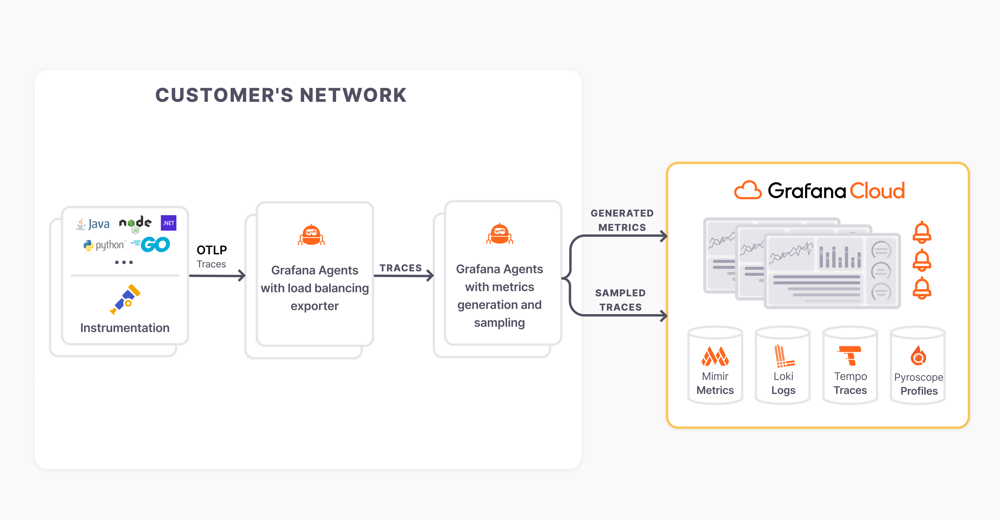

# grafana-sampling

  

A Helm chart for a layered OTLP tail sampling and metrics generation pipeline.

## Breaking change announcements

### **v1.0.0**

Grafana Agent has been replaced with [Grafana Alloy](https://grafana.com/oss/alloy-opentelemetry-collector/)!

These sections in your values file will need to be renamed:

| Old                         | New                 | Purpose                                        |
|-----------------------------|---------------------|------------------------------------------------|
| `grafana-agent-deployment`  | `alloy-deployment`  | Settings for the Alloy load balancing instance |
| `grafana-agent-statefulset` | `alloy-statefulset` | Settings for the Alloy tail sampling instance  |

For example, if you have something like this:

```yaml
grafana-agent-statefulset:
  agent:
```

you will need to change it to this:

```yaml
alloy-statefulset:
  alloy:
`````

This chart deploys the following architecture to your environment (note the agents have been replaced with Alloy):


Note: by default, only OTLP traces are accepted at the load balancing layer.

## Chart Repo

Add the following repo to use the chart:

```console
helm repo add grafana https://grafana.github.io/helm-charts
```
## Installing the Chart

Use the following command to install the chart with the release name `my-release`. Make sure to populate the required values.

```console
helm install my-release grafana/grafana-sampling --values - <<EOF | less
alloy-statefulset:
  alloy:
    extraEnv:
      - name: GRAFANA_CLOUD_API_KEY
        value: <REQUIRED>
      - name: GRAFANA_CLOUD_PROMETHEUS_URL
        value: <REQUIRED> # This should include /api/prom/push uri
      - name: GRAFANA_CLOUD_PROMETHEUS_USERNAME
        value: <REQUIRED>
      - name: GRAFANA_CLOUD_TEMPO_ENDPOINT
        value: <REQUIRED>
      - name: GRAFANA_CLOUD_TEMPO_USERNAME
        value: <REQUIRED>
      # This is required for adaptive metric deduplication in Grafana Cloud
      - name: POD_UID
        valueFrom:
          fieldRef:
            apiVersion: v1
            fieldPath: metadata.uid
EOF
```

## Uninstalling the Chart

To uninstall/delete the my-release deployment:

```console
helm delete my-release
```

The command removes all the Kubernetes components associated with the chart and deletes the release.

## Upgrading

A major chart version change indicates that there is an incompatible breaking change needing manual actions.

## Values

| Key | Type | Default | Description |
|-----|------|---------|-------------|
| batch.deployment | object | `{"send_batch_max_size":0,"send_batch_size":8192,"timeout":"200ms"}` | Configure batch processing options. |
| batch.statefulset.send_batch_max_size | int | `0` |  |
| batch.statefulset.send_batch_size | int | `8192` |  |
| batch.statefulset.timeout | string | `"200ms"` |  |
| metricsGeneration.dimensions | list | `["service.namespace","service.version","deployment.environment","k8s.cluster.name","k8s.pod.name"]` | Additional dimensions to add to generated metrics. |
| metricsGeneration.enabled | bool | `true` | Toggle generation of spanmetrics and servicegraph metrics. |
| metricsGeneration.legacy | bool | `true` | Use legacy metric names that match those used by the Tempo metrics generator. |
| sampling.decisionWait | string | `"15s"` | Wait time since the first span of a trace before making a sampling decision. |
| sampling.enabled | bool | `true` | Toggle tail sampling. |
| sampling.extraPolicies | string | A policy to sample long requests is added by default. | User-defined policies in alloy format. |
| sampling.failedRequests.percentage | int | `50` | Percentage of failed requests to sample. |
| sampling.failedRequests.sample | bool | `false` | Toggle sampling failed requests. |
| sampling.successfulRequests.percentage | int | `10` | Percentage of successful requests to sample. |
| sampling.successfulRequests.sample | bool | `true` | Toggle sampling successful requests. |

