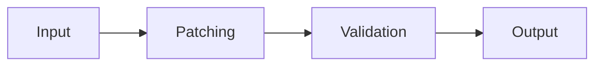

# k8s-diff tools

TL;DR:

> This package contains a set of tools for producing clean diffs that include
> only relevant information between two sets of kubernetes manifests. It does
> this by selectively ignoring and patching away uninteresting differences. At
> its core is a flexible configuration format based on
> [JsonPatches](#note-about-jsonpatchoperations). It also helps you maintain
> these patches overtime and prevent them from becoming stale.

- [k8s-diff tools](#k8s-diff-tools)
  - [Motivation](#motivation)
  - [Directory of Tools](#directory-of-tools)
  - [yaml-patch](#yaml-patch)
    - [How it works](#how-it-works)
    - [Usage](#usage)
    - [Rule File Format](#rule-file-format)
      - [Ignore Rules](#ignore-rules)
      - [Patch Rules](#patch-rules)
      - [Note about JsonPatchOperations](#note-about-jsonpatchoperations)
  - [k8s-defaults](#k8s-defaults)
    - [How it works](#how-it-works-1)
    - [Usage](#usage-1)
  - [config-generate](#config-generate)
    - [How it works](#how-it-works-2)
    - [Usage](#usage-2)
  - [config-defaults](#config-defaults)
    - [How it works](#how-it-works-3)
    - [Usage](#usage-3)

These are tools for comparing two **local** sets of kubernetes manifests.

Many tools exist for comparing local files against a running kubernetes API server - that's not what this tool does.
Instead, this tool is meant to compare two sets of kubernetes files stored locally on your computer.
This is useful when comparing two different methods of deploying an application to kubernetes.
For example in the case of Grafana Labs, we publish both Helm and Jsonnet for deploying our backend database, Grafana Mimir.

## Motivation

Directly comparing `tanka export` output to `helm template` output imposes several challenges:

1. Resources may be named differently, but otherwise identical.
   - e.g. A StatefulSet called `mimir-ingester` (Helm) vs `ingester` (Jsonnet)
2. Resource defaults may be explicitly defined by one set of manifests despite having no impact on the final state
   - e.g. setting `initContainers: []` in a PodTemplaceSpec.
3. Some differences may not be of interest to you
   - e.g. the `helm.sh/chart` label common in Helm charts doesn't really make sense in Jsonnet

Lastly, there may be so many differences that it's not reasonable to fix them all at once. 
Instead, this tool allows you to fix differences _incrementally_.

The same motivation above applies to comparing Mimir's configuration. There are
many fields, not all of them are relevant to compare, and the defaults applied
by Mimir can sometimes obscure the final diff.

## Directory of Tools

| Tool            | Purpose                                                                                                                                        |
|-----------------|------------------------------------------------------------------------------------------------------------------------------------------------|
| yaml-patch      | apply JSONPatch documents to yaml files (useful for patching out uninteresting differences)                                                    |
| k8s-defaulter   | apply kubernetes defaulting logic to yaml files **This requires a running k8s api server, since it works via the server-side dry-run feature** |
| config-generate | Generate final mimir configuration from a set of kubernetes Deployments or StatefulSets. **This requires docker**                              |
| config-defaults | Remove fields from mimir configuration that match Mimir defaults. **This requires docker**                                                     |


## yaml-patch

### How it works

yaml-patch copies yaml files from one directory to another and optionally performs some transformation to the data in between.

Internally, yaml-patch has two main phases as indicated in the diagram below.

1. Preprocessing
    - During this phase, manifests are modified in order to eliminate superfluous differences that are deemed unimportant by the user
2. Validation
    - During this phase, debug information collected during preprocessing is used to validate that all rules defined in the config file actually impact the final output.



### Usage

```
Usage of yaml-patch:
  -input-dir value
    	Input directory, can be specified multiple times - must have the same number of elements as output-dir
  -output-dir value
    	Output directory, can be specified multiple times - must have the same number of elements as input-dir
  -output-template string
    	Template used to generate output file names.
  -rules value
    	Rule file to load, can be specified multiple times
```

A typical invocation might look like this:

```
yaml-patch -input-dir input-dir -output-dir output-dir \
     -rules renames.yml \
     -rules ignored_fields.yml 
```

### Rule File Format

Rule files can be specified multiple times via the `-rules` flag. Rules across all files are collected and run in the following order

1. Ignore rules from all files, in the order specified
3. Patch rules from all files, in the order specified

Below is an example rule file that ignores all objects with `kind: Secret` and ignores annotations across all objects.

```
---
ignore_rules:
- name: "Ignore all secrets"
  match:
  - op: test
    path: /kind
    value: Secret

patch_rules:
- remove_field: /metadata/annotations
```

All rules have a `name` and `match` field. See below for detailed notes about available fields on each rule.


#### Ignore Rules

Ignore rules are used to completely remove any object from the output.

Ignore rules have the following structure:

```
- name: string
  match: []JsonPatchOperation
```

- `name` is meant for documentation only. It is used in the program output to communicate issues to the user.
- `match` is a [JsonPatch](#note-about-jsonpatch) value. If the patch can be successfully applied to a given object, then that object is said to "match" the ignore rule. Any objects matching the ignore rule are filtered from the output entirely. An empty `match` section will match every object.

#### Patch Rules

Patch rules are used to modify objects before the final diff is computed. 
This is most commonly used to rename objects or alter their fields such that the rendered diff only contains relevant information.

Patch rules have the following structure:

```
- name: string
  match: []JsonPatchOperation (optional)
  steps: []JsonPatchOperation
  remove_field: jsonpointer (optional), (e.g. /metadata/labels/name)
  rename_object: (optional)
    from: string, name to replace in /metadata/name
    to: string, target name
  rename_field: (optional)
    from: jsonpointer (optional), (e.g. /metadata/labels/name)
    to: jsonpointer (optional), (e.g. /metadata/labels/name)
  <jsonpointer>: []any (optional)
```

- `name` is meant for documentation only. It is used in the program output to communicate issues to the user.
- `match` is a [JsonPatch](#note-about-jsonpatchoperations) value. If the patch can be successfully applied to a given object, then that object is said to "match" the patch rule. An empty `match` section will match every object.
- `steps` is a [JsonPatch](#note-about-jsonpatchoperations) value. Any objects matching the patch rule will have this JsonPatch applied to them.

The `remove_field`, `rename_object`, and `rename_field` properties are all shorthand for various JsonPatchOperations. A desugaring step before rule application converts these fields into additional items in one or both of the `match` and `steps` fields. They are provided as convenient shorthands to reduce noise in the rules files. When using one of `remove_field`, `rename_object`, or `rename_field`, the `name` is optional. It will be generated according to the relevant shorthand if absent.

- `remove_field` adds an additional `remove` operation to both the `match` and `steps` section. Adding the `remove` operation to the `match` section ensures that the rule only applies to objects that actually have that property.
- `rename_object` adds an additional `test` operation to the `match` section and an additional `replace` operation to the `steps` section. The end result is that any object where the `/metadata/name` field matches `rename_object.from` will be renamed to `rename_object.to`
- `rename_field` adds an additional `remove` operation to the `match` section and an additional `move` operation to the `steps` section. The end result is that any object containing a value in the field denoted by `rename_field.from` will have that value moved to the field denoted by `rename_field.to`. This is useful to rename labels for example.

The final field noted above `<jsonpointer>` allows arbitrary fields to be matched with a simple shorthand. For example:

```
- name: "Remove containers"
  remove_field: /spec/template/spec/containers
  /kind: ["StatefulSet", "Deployment"]
```

The above rule will match any object where `/kind` is either `StatefulSet` or `Deployment`.

This can be used on multiple fields, which are AND-ed together. For example:

```
- name: "Remove containers"
  remove_field: /spec/template/spec/containers
  /kind: ["StatefulSet", "Deployment"]
  /metadata/name: ["ingester", "querier"]
```

The above rule will result in 4 new rules being created, one for each combination of `/kind` and `/metadata/name`:

- (/kind: StatefulSet, /metadata/name: ingester)
- (/kind: Deployment, /metadata/name: ingester)
- (/kind: StatefulSet, /metadata/name: querier)
- (/kind: Deployment, /metadata/name: querier)

#### Note about JsonPatchOperations

Both the `match` and `steps` fields are of type []JsonPatchOperation. 
This refers to [RFC 6902](https://tools.ietf.org/html/rfc6902). 
This is the same patch description system used by [kustomize](https://kustomize.io/).

## k8s-defaults

### How it works
k8s-defaults makes use of the server-side dry run feature in kubernetes to set default values on kubernetes objects.

**This requires a running kubernetes API server and will use the current active kubectl context**

No resources are actually created, but the local data is sent to the API server for processing.

### Usage

```
Usage of k8s-defaults:
  -input-dir string
    	Input directory
  -output-dir string
    	Output directory
```

## config-generate

### How it works
config-generate follows this process:

1. Extract any deployment or statefulset objects using the `grafana/mimir` image. 
2. Analyze the `-config.file` argument, `volumemounts`, `volumes`, `configmap`,
   and `secret` objects to extract the text contents of the mimir config file
   (if present)
3. Run the `grafana/mimir` image locally with the resolved config file and arguments from the manifests - plus the `-print.config` flag.
4. The result is written to a file in the output directory for further
   processing.

### Usage

```
Usage of config-generate:
  -input-dir string
    	Input directory
  -output-dir string
    	Output directory
```

## config-defaults

### How it works
config-defaults follows this process:

1. Use the same mechanism as config-generate to produce a Mimir config file with
   all defaults set.
2. For each mimir config file int the input directory, remove any fields which
   match the defaults from the previous step
3. The result is written to a file in the output directory for further
   processing

### Usage

```
Usage of config-defaults:
  -input-dir string
    	Input directory
  -output-dir string
    	Output directory
```